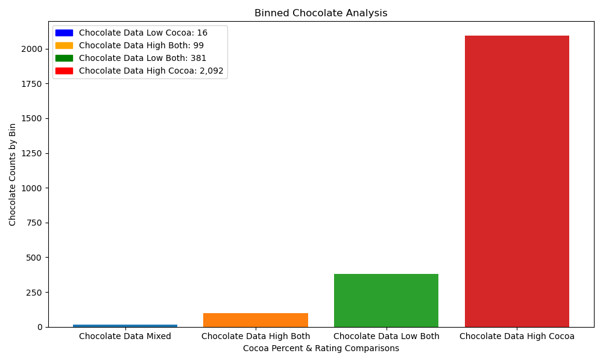
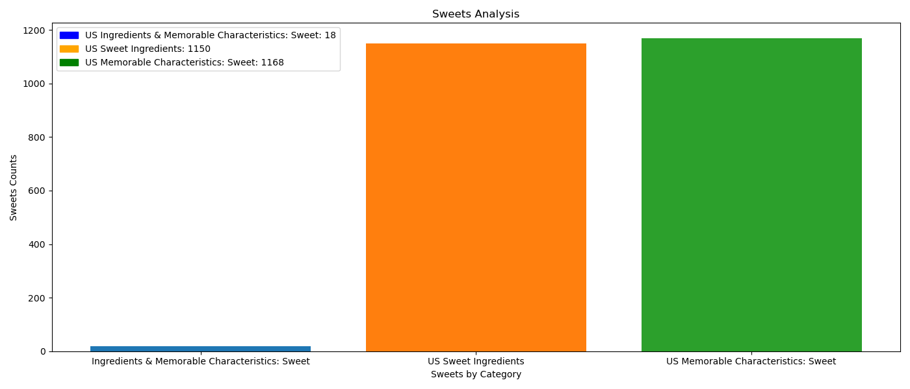

# Chocolate-
 

# Chocolate Bars

***
 

# Table of Contents
- [Introduction](#introduction)
- [Background Information](#background-information)
    - [Rating Scale](#rating-scale)
    - [Review Guide](#review-guide)
    - [Variables](#variables)
- [Overall Information](#overall)
- [Data Analysis & Vizualization](#data-analysis--vizualization)
    - [Top Ten Countries: Chocolate Ratings Count](#top-10-countries-chocolate-ratings-count)
    - [Cocoa Percentage & Rating Comparisons](#cocoa-percentage--rating-comparisons)
    - [Sweets Analysis](#sweets-analysis)
 

***
## **Introduction**
***
This dataset, which can be found [here](https://www.kaggle.com/datasets/nyagami/chocolate-bar-ratings-2022), comprises various chocolate bars with their ingredients. These determine the overall taste and flavour of the chocolates, which consequently affect their ratings. The chocolate reviews are between 2006 and 2022 for various countries.

 

***
## **Background Information**
***
The information conatined in the dataset utilizes a rating scale for the chocolate bars as well as a review guide to indicate the qualitative aspects that factor into the ratings along with the associated variables, or unique indicators, for each and every chocolate bar.

### **Rating Scale**
***
The ratings are between 1 and 5 with 1 considered the lowest rating and 5 as the highest rating possible.

- 4.0 - 5.0 = Outstanding

- 3.5 - 3.9 = Highly Recommended

- 3.0 - 3.49 = Recommended

- 2.0 - 2.9 = Disappointing

- 1.0 - 1.9 = Unpleasant
 

***
### **Review Guide**
***
- Ratings assigned to the chocolate bars are based on the following aspects:

- Flavor is the most important component of the Flavors of Cacao ratings. Diversity, balance, intensity and purity of flavors are all considered.

- Texture has a great impact on the overall experience and it is also possible for texture-related issues to impact flavour.

- Aftermelt is the experience after the chocolate has melted. Higher quality chocolate will linger and be long-lasting and enjoyable.

- Overall Opinion is really where the ratings reflect a subjective opinion.

- Other Notes- These are topics that may be interesting to discuss but may not necessarily impact the flavour or experience. For example, appearance, snap, packaging, cost etc.
 

***
### **Variables**
***
- There are ten variables in the dataset as follows:

- REF (reference number). The highest REF numbers were the last entries made. They are not unique values.

- Company name or manufacturer

- Company location (Country)

- Date of review of the chocolate ratings

- Origin of bean (Country)

- Specific bean origin or bar name

- Cocoa percent

- Ingredients: Represents the number of ingredients in the chocolate; B = Beans, S = Sugar, S* = Sweetener other than white cane or beet sugar, C = Cocoa Butter, V = Vanilla, L = Lecithin, Sa = Salt)

- Most memorable characteristics

- Rating

 
 

***
## **Overall**
***
The dataset provides a multitude of factors pertaining to chocolate ratings around the world. After analyzing the data [Chocolate bar ratings 2022](data/Chocolate_bar_ratings_2022.csv), it was determined that a logical focus would be on the assessment of the [top ten](#top-10-countries-chocolate-ratings-count) countries containing the most chocolate ratings.
 

***
## Data Analysis & Vizualization
Listed below is the data analysis and vizualtion aspects for the chocolate bars dataset.
***

### Top 10 Countries: Chocolate Ratings Count
***
After comparing the top ten countries, it was revealed that by far the United States contains the most chocloate ratings. 

  

More specifically, the United States contains well more than half of the chocolate ratings out of the top ten countries.

  

***
### Cocoa Percentage & Rating Comparisons
***
Comparisons were performed on all of the chocolate entries by binning the cocoa percentage and cocoa ratings into four distinct groups to better determine the respective linkages. It should be noted that greater thn 80% of the entries fell into the bin of a high cocoa percentage, which was chosen to be 70%, and a low rating, which is under a 4.0. If we recall from our rating scale above, a 4.0 is the lower threshold for the outstanding rating.
  

To further analyze the cocoa percentage and cocoa rating, the linear, numerical pearson correlation and the nonlinear, numerical spearman correlation were utilized; the values yielded were -0.14456895490488086 and -0.10700879647699718, respectiviely which shows no correlation.  

 

***
### Sweets Analysis
***
Seeing as the United States contained the majority of the choloate ratings, a sweets analysis was performed specific to this region. In particular, it seemed interesting to determine the number of United States chocolate ratings that contained a real or artifical sweetener in their product, listed in the ingredients, as well as the sweet flavor in fact being a memorable characteristic. From there, a comparison was executed to determine the overlap of the sweet trait in both the ingredients along with the memorable characteristics. Although 1,150 of the chocolate bars contained a sweet, or sugar, ingredient and 1,168 of the chocolate bar ratings contained the sweet profile as a memorable chracteristic, only 155 chocolate ratings contained both sweet as an ingredient and as a memorable characteristic. Further analysis could be performed to see if the cocoa percent played a factor, or had a correlation, to the sweetness being in the ingredients and a listed as a memorable characteristic.
  